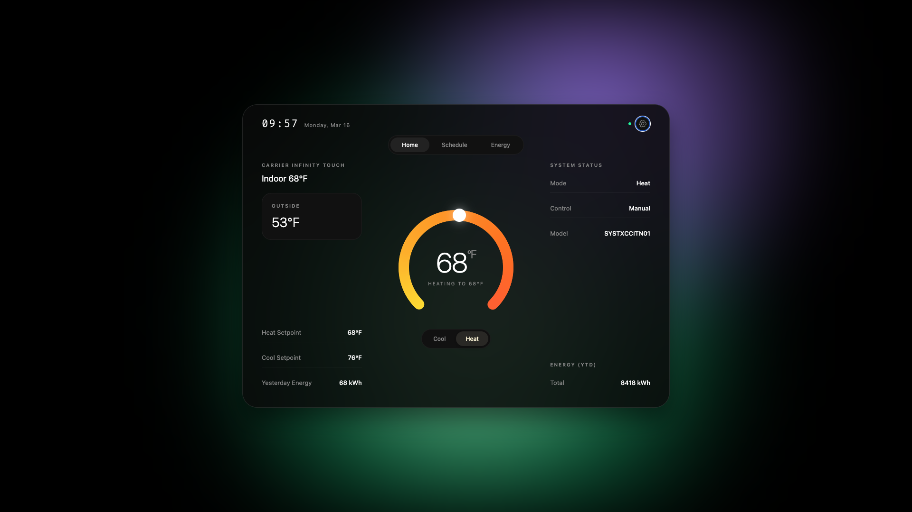
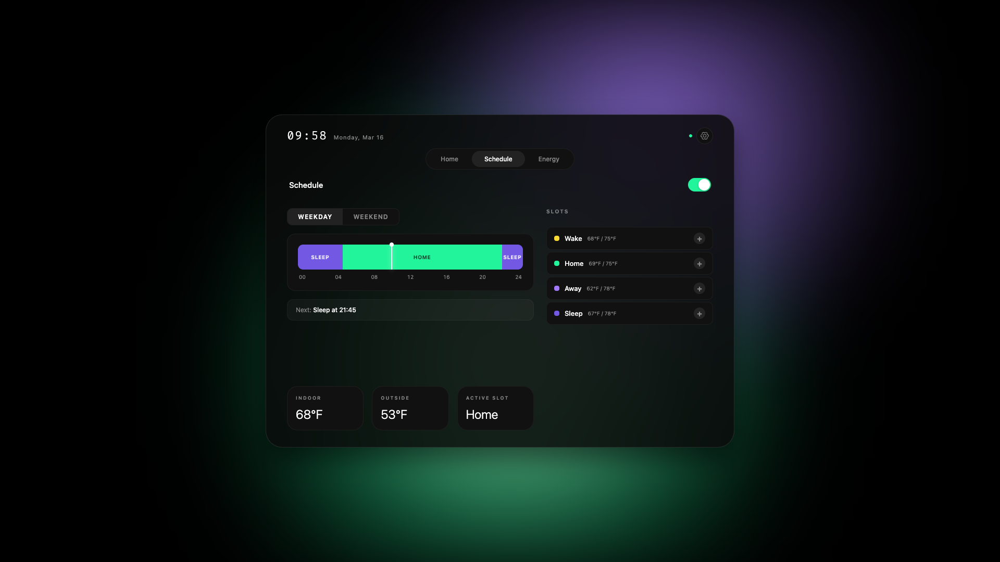

<p align="center">
  
</p>

<h1 align="center">pyfinity</h1>

<p align="center">
  Remote control for <b>non-WiFi Carrier Infinity Touch thermostats</b> (SYSTXCCITN01) via the RS-485 ABCD bus.<br/>
  A $15 USB adapter and Python. No cloud, no proprietary hardware.
</p>

---

## Web UI

Pyfinity has a web UI (Python server + React frontend) with temperature control, a scheduler for heating/cooling profiles, and energy tracking.

<p align="center">
  
</p>

<p align="center">
  
</p>

---

## CLI

The CLI works on its own if you don't need the web server:

```
$ ./carrier_ctl.py status

Indoor:    68°F
Outdoor:   47°F
Heat set:  68°F
Cool set:  75°F

      Energy   HP heat   Cooling    Elec    Fan   Total
----------------------------------------------------
   Yesterday       17         0      10      0     27 kWh
  2 days ago       25         0      18      0     43 kWh

      Yearly   HP heat   Cooling    Elec    Fan   Total
----------------------------------------------------
    2026 YTD      362         0    7343     --   7705 kWh
        2025     2637       527    3931     15   7110 kWh
```

```
$ ./carrier_ctl.py set-heat 71
Heat: 68°F → 71°F...... done! (71°F)

$ ./carrier_ctl.py set-cool 76
Cool: 75°F → 76°F...... done! (76°F)
```

## Requirements

- Python 3.10+
- [pyserial](https://pypi.org/project/pyserial/): `pip install pyserial`
- USB-to-RS485 adapter (any FTDI-based adapter works, ~$15)
- Carrier Infinity Touch thermostat connected via ABCD bus

## Hardware setup

1. Get a USB-to-RS485 adapter (e.g. [Waveshare USB to RS485](https://www.amazon.com/Industrial-Converter-Adapter-Protection-Support/dp/B0B2QSW67D))
2. Connect two wires from your thermostat's **A** and **B** terminals to the adapter's **A+** and **B-** terminals
3. Plug the USB end into your computer or Raspberry Pi

You can tap into the A/B terminals at the thermostat wall plate — no need to access the furnace. Just piggyback your wires alongside the existing ones under the screw terminals.

**Warning:** Do NOT connect to the C or D terminals. They carry 24VAC and will fry your adapter.

## Usage

```bash
# Read current status
./carrier_ctl.py status

# Set heat setpoint (55-85°F)
./carrier_ctl.py set-heat 72

# Set cool setpoint (60-90°F)
./carrier_ctl.py set-cool 76

# Specify serial port manually (auto-detected by default)
./carrier_ctl.py --port /dev/ttyUSB0 status
```

## How it works

Carrier Infinity systems use a proprietary RS-485 bus (called ABCD) running at 38400 baud. The thermostat, air handler, and heat pump all talk on this bus.

We impersonate a SAM (System Access Module) at address `0x9201` and read/write thermostat table `00400a`, the Zone 1 comfort profile. Heat setpoint is byte 25, cool setpoint is byte 26.

Single writes don't stick -- the thermostat has an internal processing cycle that overwrites them. So we write the new value 6 times at 5-second intervals until it lands in the right window. That's why set commands take about 30 seconds.

## Compatibility

Tested with:
- Carrier Infinity Touch SYSTXCCITN01-A (non-WiFi thermostat)
- Variable Speed Fan Coil CESR131329-17 (air handler)
- Variable Speed Compressor CESR131438-09 (heat pump)
- macOS and Linux/Raspberry Pi

## Disclaimer

This talks directly to your HVAC system over a reverse-engineered protocol. Use at your own risk.

## License

MIT
